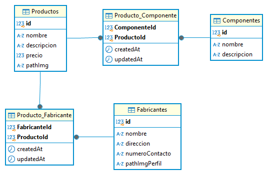

# Estrategias de Persistencia - TP 2024

## Descripción del Proyecto

Este trabajo práctico tiene como objetivo principal demostrar la experiencia práctica adquirida en la implementación de asociaciones 1 a N y N a M en el contexto de una API REST utilizando un ORM (Object-relational mapping).


## Instrucciones para correr la API

Deberá instalar las dependencias antes de utilizar la API y configurar el Puerto donde escucha las peticiones.

### Intalación de Dependencias

Deberá contar con las dependencias de producción y desarrollo usadas en el proyecto. Para eso usar el siguiente comando:

``npm i``

### Configuración del Puerto

Deberá configurar el puerto de acceso en el cual estará escuchando la app. Para hacerlo definir el puerto a través de la variable de entorno definida en el archivo .env

``PORT : "Número del Puerto"``


## Base de Datos

La configuración del motor de base de datos puede ser cambiada fácilmente redefiniendo los valores de las variables de entorno en el archivo .env

```
DB_USERNAME : "Nombre del usuario con el que se accede a la Base de Datos"

DB_PASSWORD : "Password de acceso"

DB_NAME : "Nombre de la Base de Datos"

DB_HOST : "Dirección del Host"

DB_DIALECT : "Dialecto del Motor de Base de Datos"
```


### Modelo Relacional

La estructura de la base de datos de la app está basada en el siguiente diagrama de entidad-relacion (DER) []()

### Descripción del modelo DER

- Un **Producto** puede tener muchos fabricantes, y un **Fabricante** puede fabricar muchos productos.
- Un **Producto** puede tener muchos componentes, y un **Componente** puede formar parte de varios productos.


## Uso de la API

Lista de los Endpoints disponibles para las peticiones a la API

| Verbo  | Recurso                    | Descripción                                           |
| ------ | -------------------------- | ------------------------------------------------------ |
| GET    | /productos                 | Obtener todos los productos                            |
| GET    | /productos/:id             | Obtener un producto en particular                      |
| POST   | /productos                 | Crear un producto                                      |
| PUT    | /productos/:id             | Modificar los datos de un producto en particular       |
| DELETE | /productos/:id             | Borrar un producto en particular                       |
| POST   | /productos/:id/fabricantes | Crear la asociación de producto con 1 o N fabricantes |
| GET    | /productos/:id/fabricantes | Obtener todos los fabricantes de un producto           |
| POST   | /productos/:id/componentes | Crear la asociación de producto con 1 o N componentes |
| GET    | /productos/:id/componentes | Obtener todos los componentes de un producto           |
| GET    | /fabricantes               | Obtener todos los fabricantes                          |
| GET    | /fabricantes/:id           | Obtener un fabricante en particular                    |
| POST   | /fabricantes               | Crear un fabricante                                    |
| PUT    | /fabricantes/:id           | Modificar los datos de un fabricante en particular     |
| DELETE | /fabricantes/:id           | Borrar un fabricante en particular                     |
| GET    | /fabricantes/:id/productos | Obtener todos los productos de un fabricante           |
| GET    | /componentes               | Obtener todos los componentes                          |
| GET    | /componentes/:id           | Obtener un componente en particular                    |
| POST   | /componentes               | Crear un componente                                    |
| PUT    | /componentes/:id           | Modificar los datos de un componente en particular     |
| DELETE | /componentes/:id           | Borrar un componente en particular                     |
| GET    | /componentes/:id/productos | Obtener todos los productos de un componente           |


### Ejemplos

A modo de ejemplo se muestra el resultado de algunas respuesta de los endpoind detallado en la tabla de la sección anterior.

Recurso:  **_/fabricantes/1/productos_**

Obtiene los datos del fabricante registrado con el id 1, con todos los productos que fabrica, incluyendo los atributos de cada producto y los componentes asociados a esos productos.

```
{
    "id": 1,
    "nombre": "TechCorp",
    "direccion": "1234 Elm St, Ciudad",
    "contacto": "+123456789",
    "pathImgPerfil": "/images/fabricantes/techcorp.jpg",
    "productos": [
        {
            "id": 1,
            "nombre": "Laptop X200",
            "descripcion": "Una laptop de alto rendimiento",
            "precio": 1200.99,
            "pathImg": "/images/productos/laptop-x200.jpg",
            "componentes": [
                {
                    "id": 1,
                    "nombre": "Procesador Intel i7",
                    "descripcion": "Procesador de octava generación"
                },
                {
                    "id": 2,
                    "nombre": "SSD 1TB",
                    "descripcion": "Disco sólido de 1TB de capacidad"
                }
            ]
        },
        {
            "id": 2,
            "nombre": "Smartphone S5",
            "descripcion": "Teléfono inteligente con pantalla OLED",
            "precio": 799.99,
            "pathImg": "/images/productos/smartphone-s5.jpg",
            "componentes": [
                {
                    "id": 3,
                    "nombre": "Pantalla OLED 6.5 pulgadas",
                    "descripcion": "Pantalla de alta definición"
                },
                {
                    "id": 4,
                    "nombre": "Batería 4000mAh",
                    "descripcion": "Batería de larga duración"
                }
            ]
        }
    ]
}
```

Recurso: **_/productos/1/fabricantes_**

Obtiene los datos del producto registrado con el id 1, con todos los fabricantes que lo producen, incluyendo los atributos de cada fabricante.

```
{
    "id": 1,
    "nombre": "Laptop X200",
    "descripcion": "Una laptop de alto rendimiento",
    "precio": 1200.99,
    "pathImg": "/images/productos/laptop-x200.jpg",
    "fabricantes": [
        {
            "id": 1,
            "nombre": "TechCorp",
            "direccion": "1234 Elm St, Ciudad",
            "contacto": "+123456789",
            "pathImgPerfil": "/images/fabricantes/techcorp.jpg"
        },
        {
            "id": 2,
            "nombre": "Innovatech",
            "direccion": "4567 Oak Ave, Ciudad",
            "contacto": "+987654321",
            "pathImgPerfil": "/images/fabricantes/innovatech.jpg"
        }
    ]
}
```
